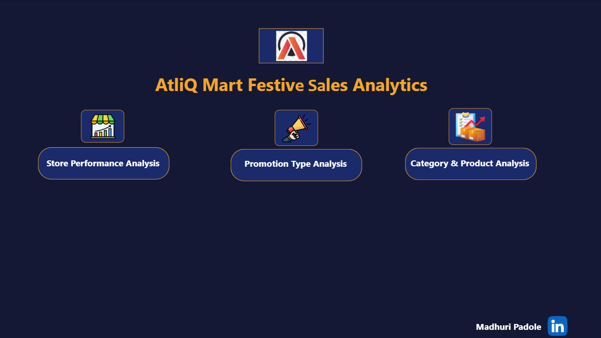
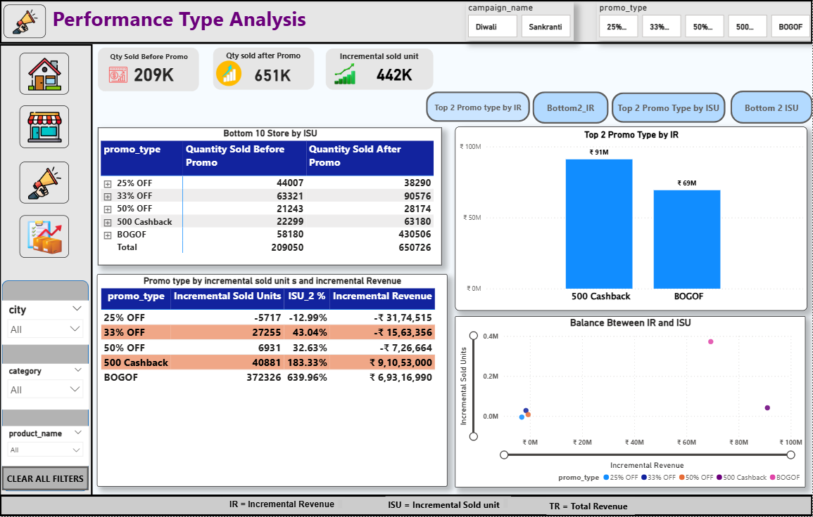
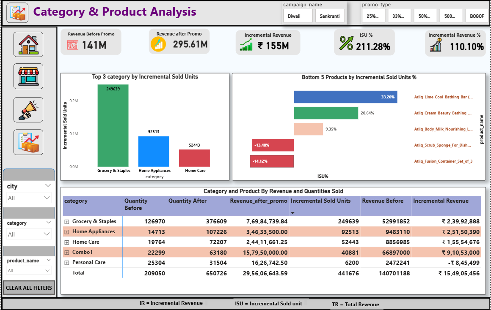
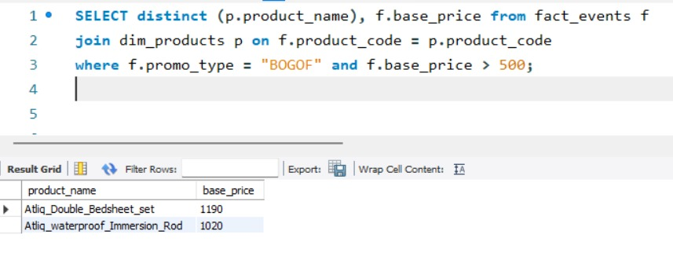
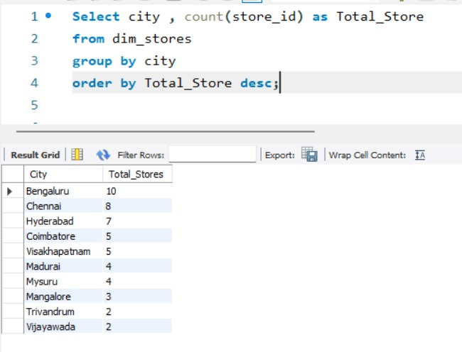
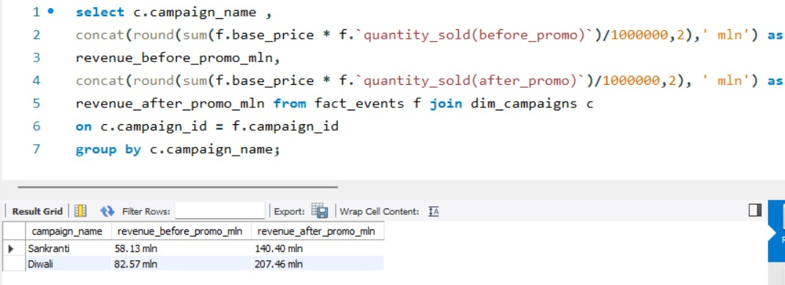
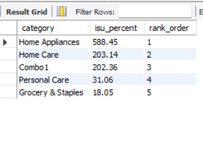
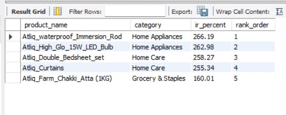

# 🛒 AtliQ Mart Festive Sales Analytics

**Domain:** FMCG &nbsp;|&nbsp; **Function:** Sales / Promotions

---

## 🎯 Project Overview

AtliQ Mart is a retail giant with over **50 supermarkets** in the southern region of India. All their stores ran massive promotions during **Diwali 2023** and **Sankranti 2024** on their AtliQ branded products.

The sales director wanted to understand **which promotions did well and which did not** — to make informed decisions for the next promotional period.

This project combines **SQL Analysis** and an **interactive Power BI Dashboard** to deliver complete insights into the festive promotional campaigns.

---

## 🛠️ Tools & Technologies

| Tool | Purpose |
|---|---|
| MySQL | Data Analysis & Querying |
| MySQL Workbench | Query Execution |
| Power BI | Dashboard & Visualization |
| GitHub | Version Control |

---

## 🗄️ Database Information

- **Database Name:** `retail_events_db`
- **Tables Used:**
  - `fact_events` – transactional sales and promotion data
  - `dim_products` – product master data
  - `dim_stores` – stores master data
  - `dim_campaigns` – campaign master data

---

## 📊 Power BI Dashboard

### 🏠 Home Page

---

### 🏪 Store Performance Analysis

**Key Insights:**
- 📍 Bengaluru leads with 10 stores — highest market presence
- 💰 Total Revenue: ₹436M | Incremental Revenue: ₹155M
- 📦 Incremental Sold Units: 442K
- 🏆 Top performing stores concentrated in Bengaluru & Chennai
- 📈 Revenue after promo significantly higher than before in all cities

---

### 📢 Promotion Type Analysis

**Key Insights:**
- 🥇 BOGOF & 500 Cashback promotions drove maximum Incremental Sold Units
- 📉 25% OFF & 33% OFF showed negative Incremental Revenue
- ⚡ Dynamic buttons allow switching between Top/Bottom 2 by IR and ISU
- 🎯 500 Cashback & BOGOF are the most effective promotion strategies

---

### 🛍️ Category & Product Analysis

**Key Insights:**
- 🌾 Grocery & Staples has highest quantity sold after promo (376K units)
- 🏠 Home Appliances showed best Incremental Revenue growth
- 📈 Overall ISU%: 211.28% | IR%: 110.10%
- ❌ Personal Care category showed negative Incremental Revenue
- 🏆 Combo1 category gave highest revenue per unit sold

---

## 📝 SQL Analysis — Business Questions

### 1. High-Value Products under BOGOF Promotion

**Business Question:**
Provide a list of products with a base price greater than 500 that are featured in a BOGOF (Buy One Get One Free) promotion.

**SQL Logic Used:**
Joined `fact_events` and `dim_products` tables using `product_code` and filtered records where `base_price > 500` and `promo_type = 'BOGOF'`.

**SQL Query:**
[View all SQL queries](all_queries.sql)

**Output:**

**Insight:**
Only two premium products with base prices above ₹1000 are included in BOGOF promotions. This suggests that the BOGOF strategy is selectively applied to high-value household items, likely to drive higher sales volumes for expensive products during festive periods.

---

### 2. Store Distribution by City

**Business Question:**
Generate a report showing the number of stores in each city, sorted by store count in descending order.

**SQL Logic Used:**
Aggregated store data from `dim_stores` by grouping records at the city level and counting the number of stores per city.

**SQL Query:**
[View SQL queries](all_queries.sql)

**Output:**

**Insight:**
Bengaluru has the highest store presence with 10 stores, followed by Chennai (8) and Hyderabad (7), indicating a strong focus on major metro markets. Tier-2 cities such as Trivandrum and Vijayawada have relatively lower store counts, suggesting potential expansion opportunities.

---

### 3. Campaign-wise Revenue Before and After Promotion

**Business Question:**
Generate a report that displays each campaign along with the total revenue generated before and after the promotion.

**SQL Logic Used:**
Joined `fact_events` and `dim_campaigns` tables using `campaign_id`. Revenue was calculated by multiplying base price with quantity sold before and after promotion, aggregating at campaign level, and converting values into millions.

**SQL Query:**
[View SQL queries](all_queries.sql)

**Output:**

**Insight:**
Both Diwali and Sankranti campaigns delivered substantial revenue uplift. Diwali emerged as the stronger campaign, increasing revenue from 82.57M to 207.46M, while Sankranti grew from 58.13M to 140.40M. Diwali campaigns outperformed Sankranti in overall revenue generation.

---

### 4. Incremental Sold Quantity (ISU%) by Category – Diwali Campaign

**Business Question:**
Calculate the Incremental Sold Quantity Percentage (ISU%) for each product category during the Diwali campaign and rank the categories based on their ISU%.

**SQL Logic Used:**
Filtered data for the Diwali campaign and joined `fact_events`, `dim_campaigns`, and `dim_products` tables. Post-promotion quantities were adjusted for BOGOF offers. Category-wise quantities were aggregated and ISU% was calculated and ranked.

**SQL Query:**
[View SQL queries](all_queries.sql)

**Output:**

**Insight:**
During the Diwali campaign, Home Appliances showed the highest incremental growth with an ISU% of 588.45%, ranking first. Home Care and Combo products also performed well with ISU% above 200%. Personal Care and Grocery & Staples recorded lower ISU%, suggesting a relatively smaller impact.

---

### 5. Top 5 Products by Incremental Revenue Percentage (IR%)

**Business Question:**
Create a report featuring the top 5 products ranked by Incremental Revenue Percentage (IR%) across all campaigns.

**SQL Logic Used:**
Joined `fact_events`, `dim_products`, and `dim_campaigns` tables. Revenue before and after promotion was calculated using promotion-specific discount logic (BOGOF, cashback, percentage discounts). IR% was calculated at the product level and top 5 were ranked.

**SQL Query:**
[View SQL queries](all_queries.sql)

**Output:**

**Insight:**
Products from the Home Appliances category dominate the top rankings. *Atiq Waterproof Immersion Rod* ranked first with an IR% of 266.19%, followed by *Atiq High Glo 15W LED Bulb*. Home Care products also showed strong revenue growth, while *Atiq Farm Chakki Atta (1KG)* from Grocery & Staples ranked fifth.

---

## 🔑 Key Takeaways

| Finding | Detail |
|---|---|
| Best Promotion Type | BOGOF & 500 Cashback |
| Worst Promotion Type | 25% OFF & 33% OFF |
| Best Campaign | Diwali 2023 |
| Best Category (ISU%) | Home Appliances (588.45%) |
| Best Product (IR%) | Atiq Waterproof Immersion Rod (266.19%) |
| Highest Store City | Bengaluru (10 stores) |

---

*Made with ❤️ by Madhuri Padole*
